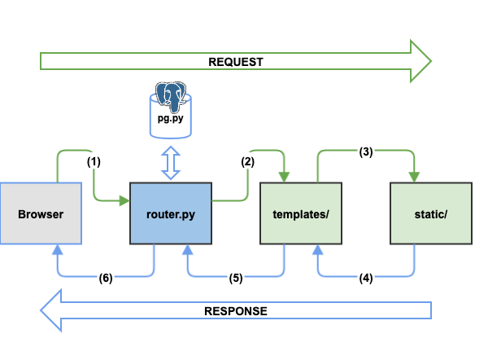

FLASK 

# Fetch Request Cycle

# Pre-requisites:

## Install Heroku's CLI
* https://devcenter.heroku.com/articles/heroku-cli
* OSX:
~~~~
$ brew tap heroku/brew && brew install heroku
~~~~

## Install flask package for python use
~~~~
pip install flask --user
~~~~

## Install virtualenv 
~~~~
$ pip install virtualenv --user
~~~~

* Create flask env 
~~~~
$ virtualenv flask
New python executable in /Users/ahbaidg/work/flask/bin/python
Installing setuptools, pip, wheel...
done.
~~~~

* Setup flask env 
~~~~
$ source flask/bin/activate
(flask) $ 
(flask) $ cd flask/
(flask) $ pwd
/Users/ahbaidg/work/flask
~~~~

* Install flask in flask env
~~~~
(flask) $ pip install flask
~~~~

## Setup heroku in flask
~~~~
$ heroku --version
heroku/7.22.2 darwin-x64 node-v11.9.0

$ heroku login -i
heroku: Enter your login credentials
Email [ahbaid@gmail.com]: 
Password: ************
Logged in as ahbaid@gmail.com
~~~~

## Setup flask app 
~~~~
(flask) $ pwd
/Users/ahbaidg/work/flask
(flask) $ mkdir -p static/css static/js static/image templates
(flask) $ touch router.py Readme.md
~~~~

## Install gunicorn
~~~~
(flask) $ pip install gunicorn
Collecting gunicorn
  Using cached https://files.pythonhosted.org/packages/8c/da/b8dd8deb741bff556db53902d4706774c8e1e67265f69528c14c003644e6/gunicorn-19.9.0-py2.py3-none-any.whl
Installing collected packages: gunicorn
Successfully installed gunicorn-19.9.0
~~~~

## Freeze Heroku requirements - requirements.txt
~~~~
(flask) $ pip freeze > requirements.txt
(flask) $ cat requirements.txt 
Click==7.0
Flask==1.0.2
gunicorn==19.9.0
itsdangerous==1.1.0
Jinja2==2.10
MarkupSafe==1.1.1
Werkzeug==0.14.1
~~~~

## Setup Heroku Procfile
~~~~
(flask) $ cat Procfile 
web: gunicorn router:app
~~~~

## Create the Heroku App
~~~~
(flask) $ heroku create 
Creating app... done, ⬢ powerful-everglades-40830
https://powerful-everglades-40830.herokuapp.com/ | https://git.heroku.com/powerful-everglades-40830.git
~~~~

## Setup for Heroku Git
* See also: https://devcenter.heroku.com/articles/git
~~~~
(flask) $ pwd
/Users/ahbaidg/work/flask

(flask) $ git init
Initialized empty Git repository in /Users/ahbaidg/work/flask/.git/

(flask) $ git config --global user.name "Ahbaid Gaffoor"
(flask) $ git config --global user.email "ahbaid@gmail.com"

(flask) $ git add Procfile 
(flask) $ git add requirements.txt 
(flask) $ git add router.py 
(flask) $ git add templates/index.html 
(flask) $ git add templates/base_layout.html 
(flask) $ git add static/image/theworld.jpg 
(flask) $ git add static/css/main.css 
(flask) $ git commit -m "heroku init"
[master (root-commit) 1d08769] heroku init
 7 files changed, 344 insertions(+)
 create mode 100644 Procfile
 create mode 100644 requirements.txt
 create mode 100644 router.py
 create mode 100755 static/css/main.css
 create mode 100644 static/image/theworld.jpg
 create mode 100644 templates/base_layout.html
 create mode 100644 templates/index.html

(flask) $ git remote add origin https://git.heroku.com/powerful-everglades-40830.git

(flask) $ git push --set-upstream origin master
Enumerating objects: 13, done.
Counting objects: 100% (13/13), done.
Delta compression using up to 4 threads
Compressing objects: 100% (10/10), done.
Writing objects: 100% (13/13), 550.56 KiB | 14.88 MiB/s, done.
Total 13 (delta 0), reused 0 (delta 0)
remote: Compressing source files... done.
remote: Building source:
remote: 
remote: -----> Python app detected
remote: -----> Installing python-3.6.8
remote: -----> Installing pip
remote: -----> Installing SQLite3
remote: -----> Installing requirements with pip
remote:        Collecting Click==7.0 (from -r /tmp/build_72ab1cb6a6f3b35740f47bc808c873ef/requirements.txt (line 1))
remote:          Downloading https://files.pythonhosted.org/packages/fa/37/45185cb5abbc30d7257104c434fe0b07e5a195a6847506c074527aa599ec/Click-7.0-py2.py3-none-any.whl (81kB)
remote:        Collecting Flask==1.0.2 (from -r /tmp/build_72ab1cb6a6f3b35740f47bc808c873ef/requirements.txt (line 2))
remote:          Downloading https://files.pythonhosted.org/packages/7f/e7/08578774ed4536d3242b14dacb4696386634607af824ea997202cd0edb4b/Flask-1.0.2-py2.py3-none-any.whl (91kB)
remote:        Collecting gunicorn==19.9.0 (from -r /tmp/build_72ab1cb6a6f3b35740f47bc808c873ef/requirements.txt (line 3))
remote:          Downloading https://files.pythonhosted.org/packages/8c/da/b8dd8deb741bff556db53902d4706774c8e1e67265f69528c14c003644e6/gunicorn-19.9.0-py2.py3-none-any.whl (112kB)
remote:        Collecting itsdangerous==1.1.0 (from -r /tmp/build_72ab1cb6a6f3b35740f47bc808c873ef/requirements.txt (line 4))
remote:          Downloading https://files.pythonhosted.org/packages/76/ae/44b03b253d6fade317f32c24d100b3b35c2239807046a4c953c7b89fa49e/itsdangerous-1.1.0-py2.py3-none-any.whl
remote:        Collecting Jinja2==2.10 (from -r /tmp/build_72ab1cb6a6f3b35740f47bc808c873ef/requirements.txt (line 5))
remote:          Downloading https://files.pythonhosted.org/packages/7f/ff/ae64bacdfc95f27a016a7bed8e8686763ba4d277a78ca76f32659220a731/Jinja2-2.10-py2.py3-none-any.whl (126kB)
remote:        Collecting MarkupSafe==1.1.1 (from -r /tmp/build_72ab1cb6a6f3b35740f47bc808c873ef/requirements.txt (line 6))
remote:          Downloading https://files.pythonhosted.org/packages/b2/5f/23e0023be6bb885d00ffbefad2942bc51a620328ee910f64abe5a8d18dd1/MarkupSafe-1.1.1-cp36-cp36m-manylinux1_x86_64.whl
remote:        Collecting Werkzeug==0.14.1 (from -r /tmp/build_72ab1cb6a6f3b35740f47bc808c873ef/requirements.txt (line 7))
remote:          Downloading https://files.pythonhosted.org/packages/20/c4/12e3e56473e52375aa29c4764e70d1b8f3efa6682bef8d0aae04fe335243/Werkzeug-0.14.1-py2.py3-none-any.whl (322kB)
remote:        Installing collected packages: Click, Werkzeug, itsdangerous, MarkupSafe, Jinja2, Flask, gunicorn
remote:        Successfully installed Click-7.0 Flask-1.0.2 Jinja2-2.10 MarkupSafe-1.1.1 Werkzeug-0.14.1 gunicorn-19.9.0 itsdangerous-1.1.0
remote: 
remote: -----> Discovering process types
remote:        Procfile declares types -> web
remote: 
remote: -----> Compressing...
remote:        Done: 45.6M
remote: -----> Launching...
remote:        Released v3
remote:        https://powerful-everglades-40830.herokuapp.com/ deployed to Heroku
remote: 
remote: Verifying deploy... done.
To https://git.heroku.com/powerful-everglades-40830.git
 * [new branch]      master -> master
Branch 'master' set up to track remote branch 'master' from 'origin'.
~~~~

## Open the app
* https://powerful-everglades-40830.herokuapp.com/
~~~~
heroku open
~~~~

# Connecting "Hello Travels" to a database

## Create travels database in Postgres
~~~~
$ psql
psql (11.2)
Type "help" for help.

postgres=# create database travels;
CREATE DATABASE

\c flask

create table if not exists users(
   userid serial primary key,
   username varchar(25) not null,
   userpwdhash varchar(200) not null
);

insert into users(username, userpwdhash) values ('ahg','plaintext');
~~~~

## Install Flask sqlalchemy extension
* http://flask.pocoo.org/extensions/
* https://www.sqlalchemy.org/
~~~~
(flask) $ pip install flask-sqlalchemy
~~~~

## Instal Flask WTF for forms
~~~~
(flask) $ pip install flask-wtf
~~~~
# Credits
* https://github.com/lpolepeddi series on Lynda.com
